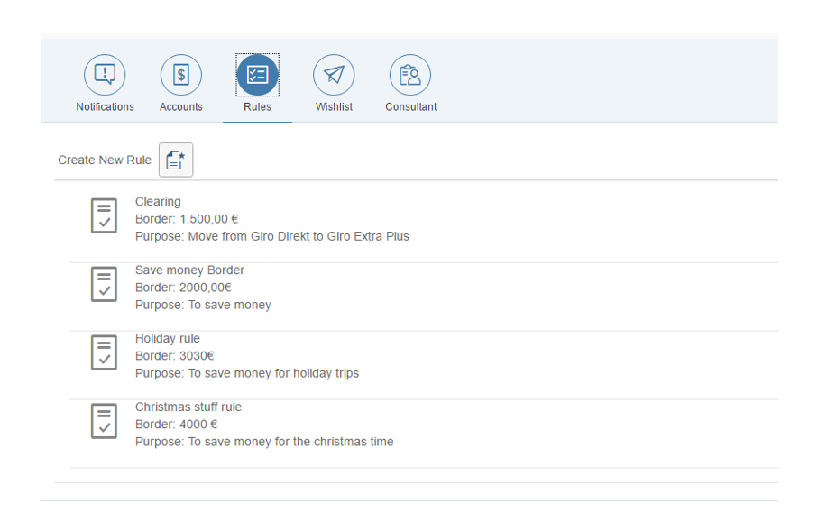
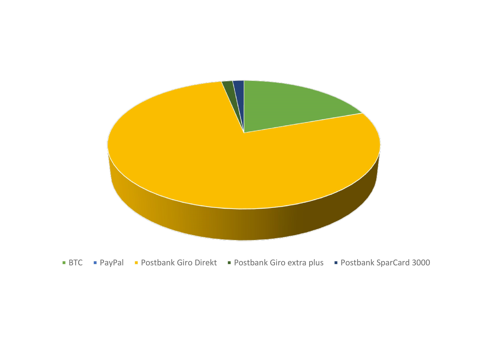
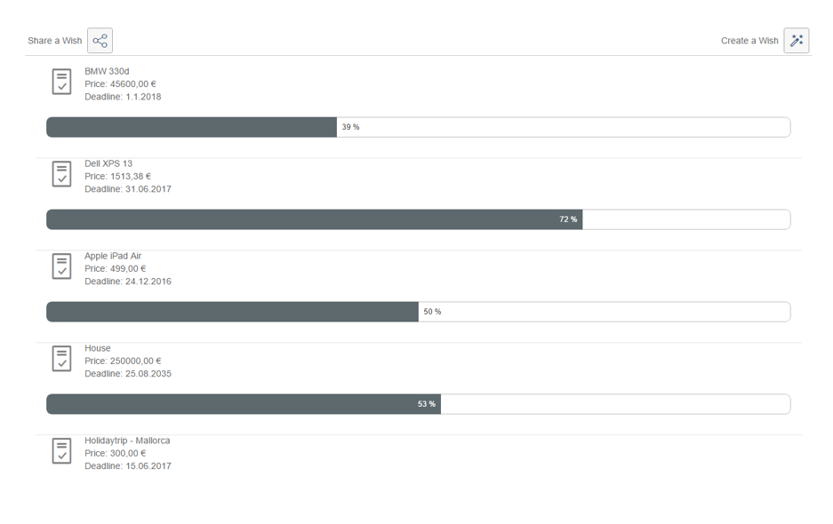
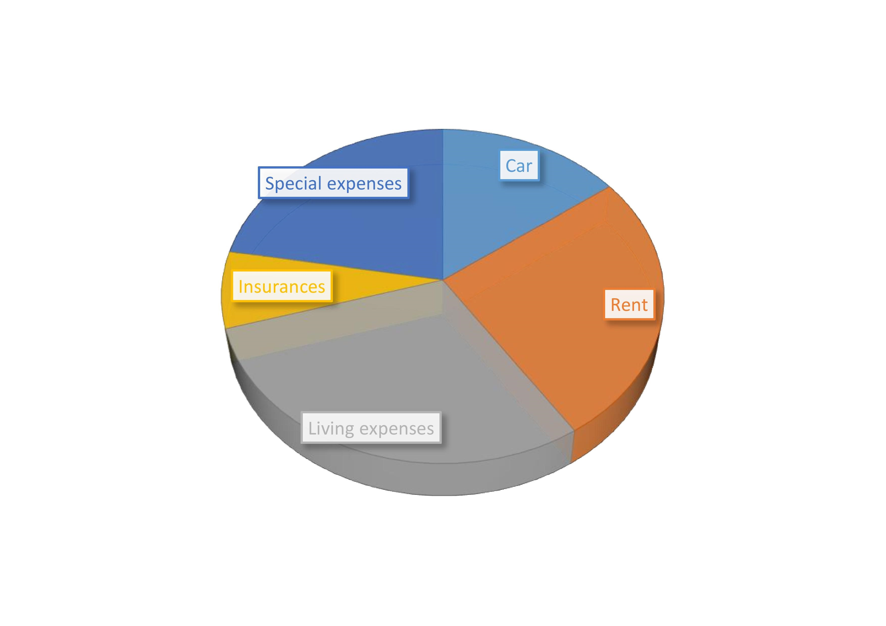
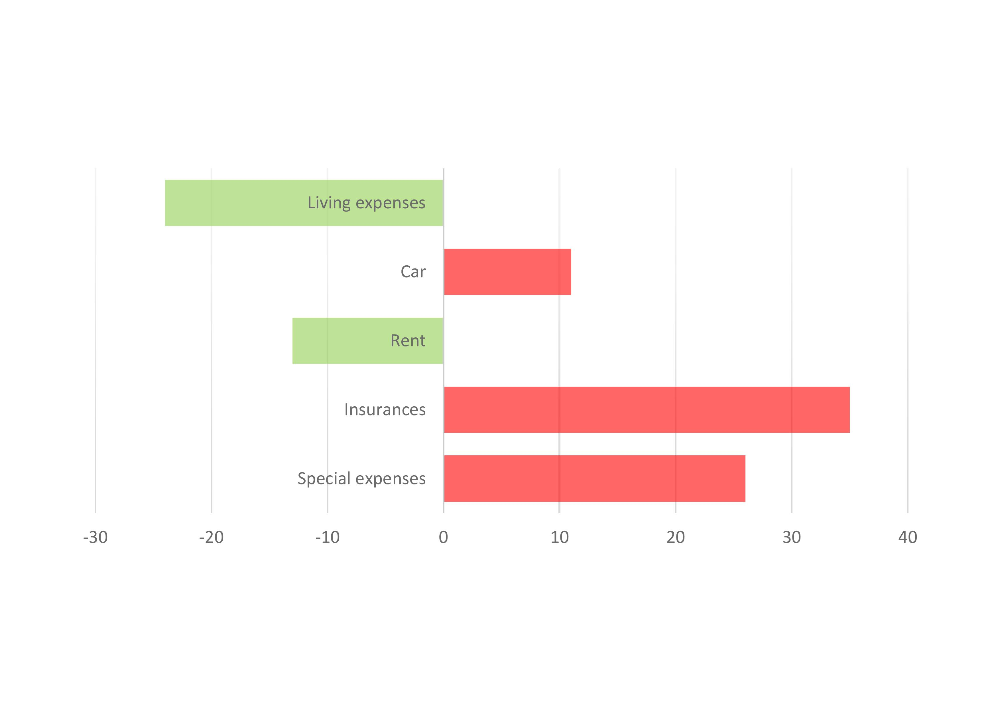
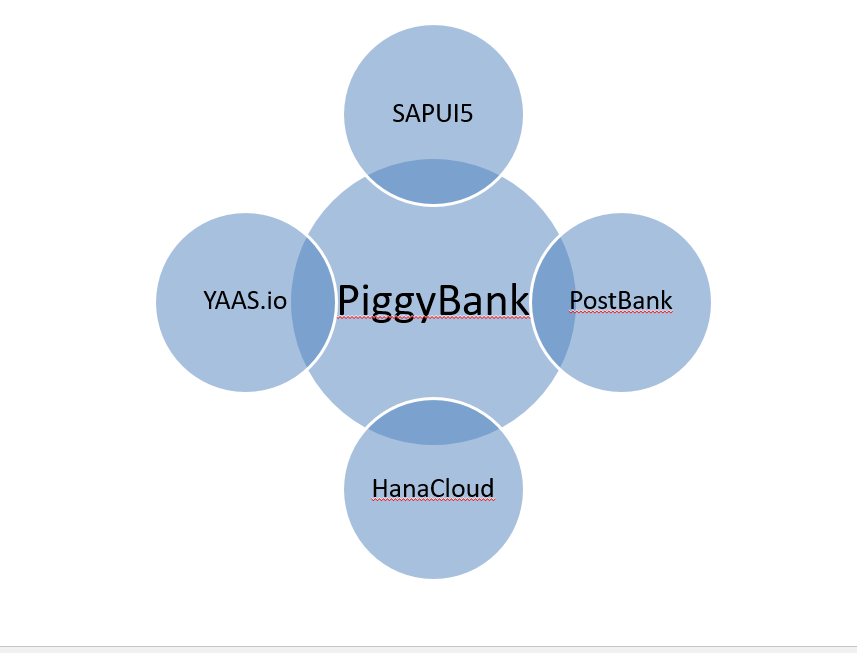

# PiggyBank

## Overview
PiggyBank allows to automatize your transactions. 
In order to there are several features developed:

* Rules
* Account Overview
* Wish-Manager
* Consultant

Find detailed information to the features below:

## Rules
With rules, you can automatize your bank account like IFTTT does your smartphone.

The following picture should explain it:

## Account Overview
The Account Overview shows you how your investments are distributed:

Several APIs are already realized, some are still to implement.

## Wish-Manager
You want to save money for your next purchase. 

Watch your progress and automatically save your money montly:

## Consultant
The virtual consultant does the job as good as your in-person bank consultant, even more:
It analyzes your expenses and compares it to other clients in the same situation (same fortune, same income, etc.)

## System overview
Finally, we have used several system (mostly provided by SAP) to realize your concept.

In this picture, you can see with APIs we have used:

## Contact
For questions or any inquires contact us:

* Andreas Hefner - andreas.hefner@hotmail.de 
* Alexander Flammer - alex.flammer@yahoo.de 
* Alexander Treib - alextreib94@gmail.com